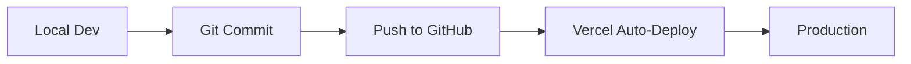

# 🚀 Vercel Deployment Guide

**Project:** Green Blue Rest Bangkok  
**Date:** 7 ตุลาคม 2025  
**Status:** Ready for Deployment

---

## 📊 Deployment Plan

We have 2 parts to deploy:

### **1. Admin Panel** (Priority: High)
- **Tech:** Next.js 14 (App Router)
- **Deploy to:** Vercel
- **URL:** `https://admin-greenbluerest.vercel.app` (or custom domain)

### **2. Frontend** (Priority: Medium)
- **Tech:** Static HTML/CSS/JS
- **Deploy to:** Vercel (or GitHub Pages)
- **URL:** `https://greenbluerestbangkok.vercel.app` (or custom domain)

---

## 🎯 Step-by-Step Deployment

### **Phase 1: Deploy Admin Panel**

#### **Step 1: Install Vercel CLI** (if not installed)
```bash
npm install -g vercel
```

#### **Step 2: Login to Vercel**
```bash
vercel login
```

#### **Step 3: Navigate to Admin**
```bash
cd admin/
```

#### **Step 4: Set Environment Variables**

**Required variables:**
```
NEXT_PUBLIC_SUPABASE_URL=your_supabase_project_url
NEXT_PUBLIC_SUPABASE_ANON_KEY=your_supabase_anon_key
```

**Set them in Vercel:**
```bash
# Option 1: Through Vercel CLI
vercel env add NEXT_PUBLIC_SUPABASE_URL
vercel env add NEXT_PUBLIC_SUPABASE_ANON_KEY

# Option 2: Through Vercel Dashboard
# Go to Project Settings → Environment Variables
```

#### **Step 5: Deploy**
```bash
# First deployment (will ask questions)
vercel

# Follow prompts:
# - Set up and deploy? Yes
# - Which scope? (your account)
# - Link to existing project? No
# - Project name? greenbluerest-admin
# - Directory? ./
# - Override settings? No

# Production deployment
vercel --prod
```

---

### **Phase 2: Deploy Frontend** (Optional)

#### **Option A: Deploy to Vercel**
```bash
cd ../src/

# Create vercel.json
cat > vercel.json << 'EOF'
{
  "cleanUrls": true,
  "trailingSlash": false
}
EOF

# Deploy
vercel
vercel --prod
```

#### **Option B: Deploy to GitHub Pages**
```bash
# Push src/ to gh-pages branch
git subtree push --prefix src origin gh-pages
```

---

## 📋 Pre-Deployment Checklist

### **Admin Panel:**
- [x] ✅ Next.js config ready
- [x] ✅ Environment variables identified
- [x] ✅ Build script works (`npm run build`)
- [x] ✅ No test endpoints in production
- [x] ✅ vercel.json configured
- [ ] ⚠️  Supabase credentials ready
- [ ] ⚠️  Custom domain (optional)

### **Frontend:**
- [x] ✅ All files in src/
- [x] ✅ Paths are relative
- [x] ✅ Images optimized
- [x] ✅ CSS organized
- [ ] ⚠️  Custom domain (optional)

---

## 🔐 Environment Variables

### **Required for Admin Panel:**

```bash
# Supabase Configuration
NEXT_PUBLIC_SUPABASE_URL=https://YOUR_PROJECT.supabase.co
NEXT_PUBLIC_SUPABASE_ANON_KEY=YOUR_ANON_KEY

# Optional: Custom Domain
NEXT_PUBLIC_SITE_URL=https://admin.yourdomain.com
```

**Where to get these:**
1. Go to Supabase Dashboard
2. Project Settings → API
3. Copy Project URL and anon/public key

---

## 🌐 Custom Domain Setup

### **For Admin Panel:**
```bash
# Add custom domain in Vercel Dashboard:
# 1. Go to Project Settings
# 2. Domains
# 3. Add Domain: admin.greenbluerestbangkok.com

# Update DNS records:
# Type: CNAME
# Name: admin
# Value: cname.vercel-dns.com
```

### **For Frontend:**
```bash
# Add custom domain:
# Type: A
# Name: @ (or www)
# Value: 76.76.21.21 (Vercel IP)
```

---

## 🧪 Post-Deployment Testing

### **Test Admin Panel:**
```bash
# Visit your deployed URL
https://your-admin-app.vercel.app

# Test:
✅ Homepage loads
✅ Login works (if enabled)
✅ API routes work
✅ Database connection works
✅ Images load
✅ All pages accessible
```

### **Test Frontend:**
```bash
# Visit your deployed URL  
https://your-frontend-app.vercel.app

# Test:
✅ Homepage loads
✅ All pages work
✅ Images load
✅ CSS applies correctly
✅ JavaScript works
✅ Supabase data loads
```

---

## ⚙️ Vercel Configuration Files

### **Admin Panel: vercel.json**
```json
{
  "buildCommand": "npm run build",
  "outputDirectory": ".next",
  "framework": "nextjs",
  "installCommand": "npm install"
}
```

### **Frontend: vercel.json**
```json
{
  "cleanUrls": true,
  "trailingSlash": false,
  "headers": [
    {
      "source": "/(.*)",
      "headers": [
        {
          "key": "Cache-Control",
          "value": "public, max-age=31536000, immutable"
        }
      ]
    }
  ]
}
```

---

## 🚨 Common Issues & Solutions

### **Issue 1: Build fails**
```bash
Error: Module not found

Solution:
- Check package.json dependencies
- Run `npm install` locally first
- Verify all imports are correct
```

### **Issue 2: Environment variables not working**
```bash
Error: NEXT_PUBLIC_SUPABASE_URL is undefined

Solution:
- Go to Vercel Dashboard → Settings → Environment Variables
- Add all required variables
- Redeploy: vercel --prod
```

### **Issue 3: API routes return 404**
```bash
Error: 404 on /api/trips

Solution:
- Check middleware.ts (should not block API routes)
- Verify API route files exist
- Check next.config.js
```

### **Issue 4: Images don't load**
```bash
Error: 403 Forbidden on images

Solution:
- Add image domains to next.config.js:
  images: {
    domains: ['gmdvkegcejrbrobtrhfm.supabase.co'],
  }
```

---

## 📊 Deployment Workflow

### **Development → Production:**



### **Recommended Workflow:**
```bash
# 1. Make changes locally
git add .
git commit -m "feat: add new feature"

# 2. Push to GitHub
git push origin main

# 3. Vercel auto-deploys
# (if connected to GitHub)

# Or manual deploy:
vercel --prod
```

---

## 🎯 Deployment Commands Cheat Sheet

```bash
# Login
vercel login

# Deploy to preview
vercel

# Deploy to production
vercel --prod

# Check deployment status
vercel ls

# View logs
vercel logs

# Remove deployment
vercel remove project-name

# Add environment variable
vercel env add VARIABLE_NAME

# Pull environment variables
vercel env pull
```

---

## 📈 Performance Optimization

### **After Deployment:**

1. **Enable Vercel Analytics:**
   - Go to Project Settings
   - Analytics → Enable

2. **Set up Caching:**
   - Already configured in vercel.json
   - Images cached automatically

3. **Monitor Performance:**
   - Check Vercel Dashboard → Analytics
   - Monitor response times
   - Check Core Web Vitals

---

## ✅ Final Checklist

### **Before Deploying:**
- [ ] All code committed to Git
- [ ] Environment variables ready
- [ ] Build works locally (`npm run build`)
- [ ] No sensitive data in code
- [ ] .env.local in .gitignore

### **During Deployment:**
- [ ] Vercel CLI installed
- [ ] Logged in to Vercel
- [ ] Project name decided
- [ ] Environment variables added
- [ ] Deployment successful

### **After Deployment:**
- [ ] Test all pages
- [ ] Test API routes
- [ ] Test database connection
- [ ] Set up custom domain (optional)
- [ ] Enable analytics
- [ ] Share URL with team

---

## 🎉 Success!

Once deployed, you'll have:

### **Admin Panel:**
```
https://your-admin.vercel.app
or
https://admin.yourdomain.com
```

### **Frontend:**
```
https://your-frontend.vercel.app
or
https://yourdomain.com
```

---

## 📞 Support

### **Vercel Resources:**
- Docs: https://vercel.com/docs
- Support: https://vercel.com/support
- Status: https://vercel-status.com

### **Next.js Resources:**
- Docs: https://nextjs.org/docs
- Deployment: https://nextjs.org/docs/deployment

---

## 🔄 Continuous Deployment

### **Connect to GitHub:**

1. Go to Vercel Dashboard
2. Import Git Repository
3. Connect to GitHub
4. Select repository
5. Configure:
   - Framework: Next.js
   - Root Directory: admin/
   - Build Command: npm run build
6. Add Environment Variables
7. Deploy!

**Result:** Every push to main = automatic deployment! 🎉

---

<div align="center">

# 🚀 **Ready to Deploy!**

Follow the steps above to deploy your project to Vercel

**Good luck!** 🍀

</div>

---

**Created:** 7 ตุลาคม 2025  
**Version:** 1.0

