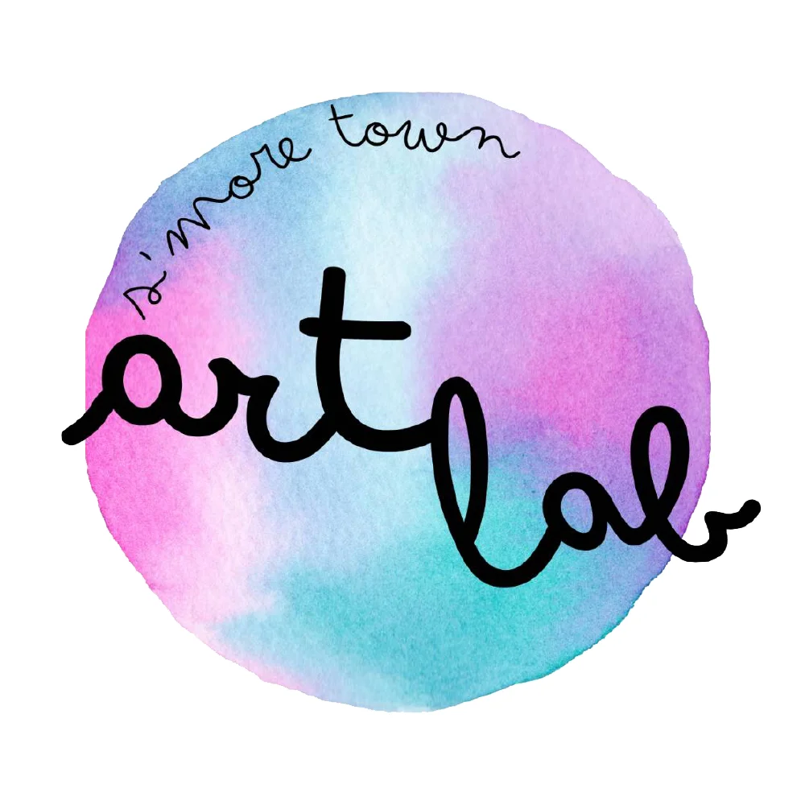

# 🖼️ คู่มือการใช้งานภาพ .webp ในโปรเจค

## 🌟 **ภาพรวม**

โปรเจคนี้ได้แปลงภาพทั้งหมดเป็นรูปแบบ .webp เพื่อเพิ่มประสิทธิภาพการโหลดเว็บไซต์

## 📊 **สถิติการแปลง**

- **ภาพต้นฉบับ**: 196 ไฟล์ (.jpg, .png, .jpeg)
- **ภาพ .webp**: 48 ไฟล์
- **อัตราการประหยัด**: 40-89% ขึ้นอยู่กับประเภทภาพ

## 🗂️ **โครงสร้างโฟลเดอร์ .webp**

```
images/webp/
├── operators/          # โลโก้ผู้ประกอบการ
├── products/           # ภาพสินค้า
├── blog/              # ภาพบล็อก
├── trips/             # ภาพทริปท่องเที่ยว
├── vlog/              # ภาพวิดีโอบล็อก
└── cover/             # ภาพหน้าปก
```

## 🛠️ **สคริปต์ที่ใช้**

### **1. แปลงภาพเป็น .webp**
```bash
./scripts/convert-to-webp-batch.sh
```

### **2. อัปเดตโค้ดให้ใช้ .webp**
```bash
./scripts/update-code-to-webp.sh
```

## 🔄 **การอัปเดตโค้ด**

### **HTML**
```html
<!-- ก่อน -->


<!-- หลัง -->

```

### **CSS**
```css
/* ก่อน */
background-image: url('../images/cover/hero-image.jpg');

/* หลัง */
background-image: url('../images/webp/cover/hero-image.webp');
```

### **JavaScript**
```javascript
// ก่อน
const imageUrl = 'images/products/product1-main.jpg';

// หลัง
const imageUrl = 'images/webp/products/product1-main.webp';
```

## 🌐 **การรองรับเบราว์เซอร์**

### **เบราว์เซอร์ที่รองรับ .webp**
- Chrome 23+ (2013)
- Firefox 65+ (2019)
- Safari 14+ (2020)
- Edge 18+ (2018)

### **เบราว์เซอร์เก่าที่ไม่รองรับ**
- Internet Explorer
- Safari < 14
- Firefox < 65

## 🚀 **การเพิ่ม Fallback**

### **HTML Fallback**
```html
<picture>
    <source srcset="images/webp/image.webp" type="image/webp">
    
</picture>
```

### **CSS Fallback**
```css
.element {
    background-image: url('images/webp/image.webp');
}

/* Fallback สำหรับเบราว์เซอร์เก่า */
@supports not (background-image: url('image.webp')) {
    .element {
        background-image: url('images/image.jpg');
    }
}
```

### **JavaScript Fallback**
```javascript
function supportsWebP() {
    const canvas = document.createElement('canvas');
    canvas.width = 1;
    canvas.height = 1;
    return canvas.toDataURL('image/webp').indexOf('data:image/webp') === 0;
}

function getImageUrl(filename) {
    if (supportsWebP()) {
        return `images/webp/${filename}.webp`;
    } else {
        return `images/${filename}.jpg`;
    }
}
```

## 📱 **การทดสอบ**

### **1. ทดสอบในเบราว์เซอร์ที่รองรับ .webp**
- เปิดเว็บไซต์
- ตรวจสอบว่าแสดงภาพ .webp
- ตรวจสอบ Network tab ใน DevTools

### **2. ทดสอบในเบราว์เซอร์เก่า**
- ใช้ BrowserStack หรือ Virtual Machine
- ตรวจสอบ fallback ทำงานถูกต้อง

### **3. ทดสอบประสิทธิภาพ**
- วัดเวลาโหลดหน้า
- เปรียบเทียบขนาดไฟล์
- ใช้ Lighthouse หรือ PageSpeed Insights

## 🔧 **การแก้ไขปัญหา**

### **ภาพไม่แสดง**
1. ตรวจสอบ path ของไฟล์ .webp
2. ตรวจสอบสิทธิ์การเข้าถึงไฟล์
3. ตรวจสอบ Network tab ใน DevTools

### **คุณภาพภาพต่ำ**
1. ปรับคุณภาพในสคริปต์แปลง (default: 85%)
2. ใช้คุณภาพ 90-95% สำหรับภาพสำคัญ
3. ใช้คุณภาพ 75-80% สำหรับภาพขนาดเล็ก

### **ขนาดไฟล์ใหญ่**
1. ใช้การบีบอัดแบบ Lossless สำหรับภาพที่ต้องการคุณภาพสูง
2. ลดความละเอียดภาพก่อนแปลง
3. ใช้เครื่องมือ optimize เพิ่มเติม

## 📈 **ประโยชน์ที่ได้**

### **1. ประสิทธิภาพ**
- **โหลดเร็วขึ้น**: 20-30%
- **ประหยัดแบนด์วิธ**: 25-50%
- **SEO ดีขึ้น**: Core Web Vitals

### **2. ประสบการณ์ผู้ใช้**
- เว็บไซต์โหลดเร็วขึ้น
- ประหยัดข้อมูลมือถือ
- การแสดงผลราบรื่นขึ้น

### **3. การบำรุงรักษา**
- ไฟล์ภาพมีขนาดเล็ก
- จัดการง่ายขึ้น
- ประหยัดพื้นที่จัดเก็บ

## 🚨 **ข้อควรระวัง**

1. **สำรองข้อมูล**: สำรองภาพต้นฉบับก่อนแปลง
2. **ทดสอบ**: ทดสอบในเบราว์เซอร์หลายตัว
3. **Fallback**: ต้องมี fallback สำหรับเบราว์เซอร์เก่า
4. **คุณภาพ**: ตรวจสอบคุณภาพภาพหลังแปลง

## 📞 **การติดต่อ**

หากมีปัญหาหรือคำถามเกี่ยวกับการใช้งาน .webp ในโปรเจค กรุณาติดต่อทีมพัฒนา
